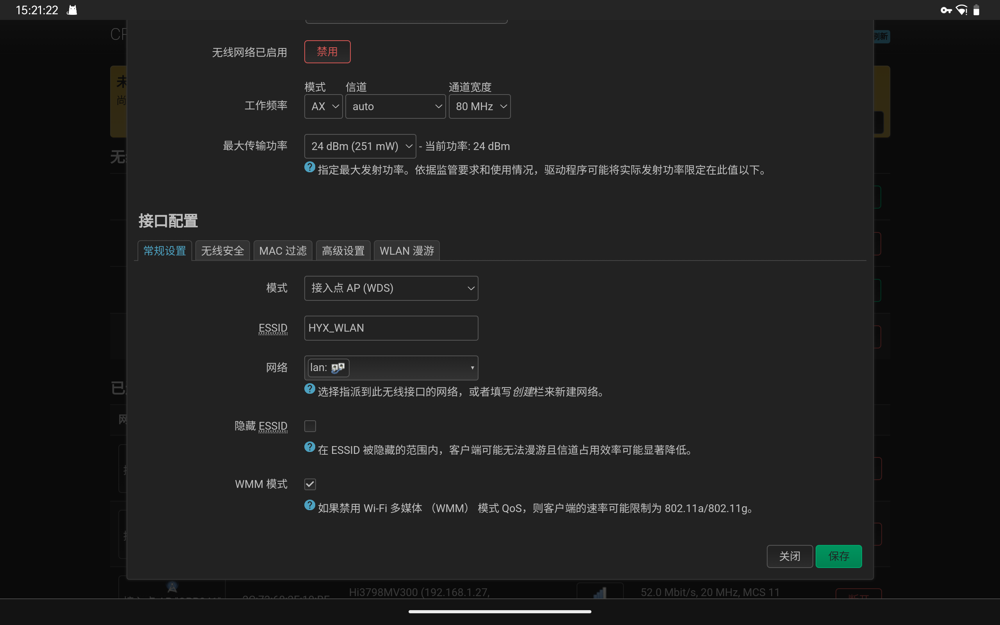
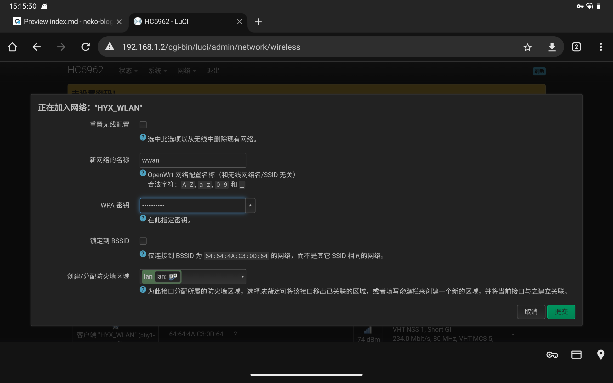
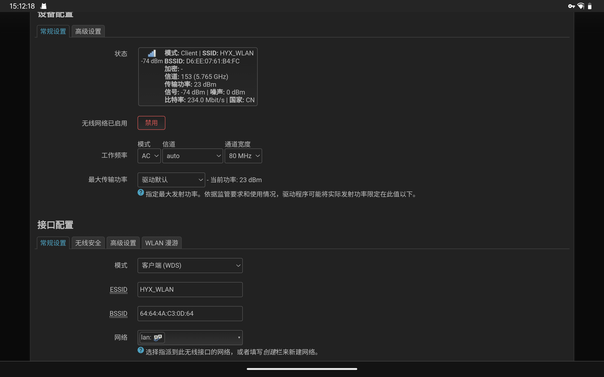

假设网络情况为：存在两台路由器

- A为主路由器，WAN口拨号，同时作为 AP
- B 路由作为附加 AP），都已刷入 Open/ImmortalWRT 系统

路由器配置：

- A 路由：192.168.1.1/24，DHCP 开
- B 路由：192.168.2.1/24，DHCP 开

希望达成无线设备均可加入 AB 路由且实现路由间信号的无缝桥接的功能。

# 步骤

设置主路由 A 的过程不再具体叙述，有需要可自行查找 OpenWRT 官网所提供的教程。

## 主路由无线设置

在这一步我们首先开启主路由的 WDS 功能，转至路由器设置的 “网络>无线” 界面。在无线信号上点击“编辑”进入设置。

接着在“接口配置－常规配置－模式”中从默认的“AP”变更为“AP(WDS)”，或者是“接入点AP（WDS）”。待新的配置保存并应用后，开始进行副路由器的配置。

## 副路由配置

在开始配置之前，建议对该路由器进行一次配置重置（按住路由器的物理 Reset 键或者在设置中恢复出厂设置都可以），以此避免先前配置对接下来步骤的影响。

接下来须严格按照本文的顺序进行配置，避免由于先后配置的冲突引起的无法再次连接至副路由器。

> 如不幸配置错误且无法连接，请再次重置。

1. 本地网络设置
  在“设置－接口－LAN－常规设置”中，更改 B 路由器的 `ipv4` 地址为 192.168.1.X（此处可自行更改，但不要改成 1 与 A 路由冲突）。  
  同时在"DHCP服务器－常规设置“中，勾选”不在此接口提供DHCP服务“。这样 LAN 部分的 DHCP 服务在桥接后就不会冲突了。    
  其他设置保持不变，应用并**重新连接到路由器**。

  > 在“高级设置”中，ipv6的设置也可以禁用防止内网设备分配到过多内网ipv6地址。

2. 无线桥接设置

  
  
  在“设置－无线”中，找到你想用于桥接的网卡并点击其“扫描”，并选择该网卡频段下 A 路由的无线信号。  
  
  

  随后填入 A 路由无线密码并勾选“锁定BSSID”，防火墙区域也选择 “lan”。  
  接着进入到无线网络配置
  
  - 在"设备配置“中，更改信道为”自动“以适配上游信号变动。  
  - 在“接口配置”中，选择模式为“客户端WDS”，网络要选择 “lan” （本地网络）。

  

  配置并应用后主副路由的设置就完成了。

## 检查网络

尝试连接 B 路由检查 DHCP 内网／外网通信是否正常，也可以通过 Wifi Analyzer 查看同 SSID 下是否存在两个 MAC 地址不同的 WIFI 信号。

